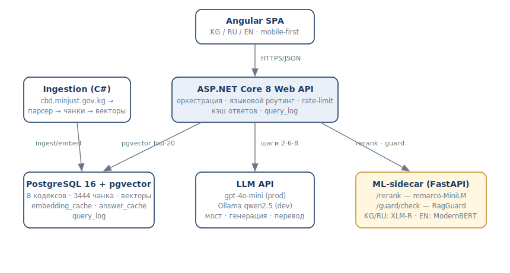

# Мыйзам (Myizam)

[](https://github.com/erjigit7/myizam/actions/workflows/ci.yml)

**A legal RAG assistant for Kyrgyzstan with a built-in hallucination detector.** Ask about your rights in Kyrgyz, Russian, or English — get a plain-language answer with references to specific articles of specific codes of the Kyrgyz Republic, automatically checked for groundedness before it reaches you.

> 📸 _Screenshots (chat with a Kyrgyz question, sources panel, /laws) — coming with the public demo._

## Why this exists

Legal information in Kyrgyzstan is public but hard to use: laws live as Word-exported HTML on [cbd.minjust.gov.kg](https://cbd.minjust.gov.kg), editions change several times a year, and there is no assistant that answers in **Kyrgyz** — the state language. Myizam indexes 8 codes (3,444 article-chunks) in their current editions and answers with citations, dates, and links to the official source.

## What makes it different

**Every answer passes a groundedness check before display.** The checker is [RagGuard](https://github.com/erjigit7/ragguard) — a pair of cross-encoder detectors, including **the first hallucination detector for the Kyrgyz language** (XLM-R, trained on a purpose-built synthetic dataset).

Honesty first: the detector runs in **shadow mode** — scores are logged, not shown — and its limits are *measured*, not assumed. Our eval initially showed that on the legal domain v1 behaved as a mere digit-consistency checker: perfect on digit substitutions, **coin-flip (0.51) on spelled-out numbers** («трех» → «девяти месяцев») — a direct consequence of its synthetic training negatives. So we retrained it on the legal corpus itself (**ragguard-kyrgyz-v2-legal**: 4.8k pairs from the codes, ru+ky, three corruption types including spelled-out numbers): word-corruption accuracy **0.51 → 0.95**, digits 0.63 → 0.91, no regression on the original news benchmark (0.979 → 0.983). The remaining measured caveat before warn mode: the retrained model is strict about loose paraphrases of the source — the next data iteration adds honest paraphrases as positives.

## Architecture



**Why a .NET core + Python sidecar:** .NET owns all state and orchestration (DB, pgvector search, LLM calls, rate limiting, language routing) — the production-grade C# surface. Python does exactly one thing torch is needed for: stateless inference of the reranker and guard models. If the sidecar dies, the API degrades gracefully (cosine top-5, guard skipped) — verified by tests.

The pipeline (10 steps): language detection → translation bridge to Russian → question embedding (+cache) → pgvector top-20 → similarity threshold → cross-encoder rerank to top-5 → generation in Russian with `[N]` source markers → marker post-validation → groundedness check → translation to the question language → full audit record in `query_log`.

## Evaluation (golden set: 30 questions — 20 ru / 5 ky / 2 en / 3 traps)

| Metric | Gate | Result |
|---|---|---|
| Retrieval hit@5 (after rerank) | ≥ 80% | **96%** |
| — Russian / English | | **100% / 100%** |
| — Kyrgyz | | **80%**¹ |
| hit@20 (before rerank) | measured | 96%² |
| Citation accuracy | ≥ 75% | **89%** |
| Trap refusal (out-of-corpus questions) | 3/3 | **3/3** |
| Guard sanity (digit corruption) | corrupted ≪ honest | Δ +0.99 |

¹ Kyrgyz jumped from 40% to 80% after replacing the generic dev-LLM bridge with **our own fine-tuned translator**: KazLLM-8B (QLoRA) trained on a parallel legal corpus extracted from the official bilingual code texts themselves — 15.8k aligned ru↔ky pairs, both directions. A spelled-out-fraction distortion caught in the live demo («одна четверть» → «төрттөн үчү», i.e. ¼→¾ — exactly the guard detector's blind spot) was traced to ~22 fraction pairs in the whole corpus and **fixed the same day** by targeted augmentation: real fraction pairs multiplied via a verified substitution table + a short continue-training pass. The v2 model now distinguishes ¼/¾ correctly with no eval-loss regression; the same augmentation is planned for the guard detector.
² bge-m3 already ranks the right article at/near the top on this corpus, so the reranker's gain shows in ordering inside top-5 rather than hit-rate — reported honestly instead of borrowing the 76→88% story from a different corpus.

An interesting calibration finding: **no hard similarity threshold separates traps from honest questions** (max trap 0.597 vs min honest 0.604). Traps are caught by the combination of a 0.5 threshold + detecting the model's own "no answer in the provided articles" response. Full report: [docs/eval_report.md](docs/eval_report.md).

## Quick start

Runs **fully local, no API keys** (Ollama for embeddings + generation):

```bash
cp .env.example .env
docker compose up -d db ml          # pgvector + rerank/guard sidecar
dotnet run --project src/Myizam.Ingestion -- ingest && dotnet run --project src/Myizam.Ingestion -- embed
```

Then `dotnet run --project src/Myizam.Api` + `cd frontend/myizam-web && npx ng serve --proxy-config proxy.conf.json` → open http://localhost:4200. Prerequisites: Ollama with `bge-m3` and `qwen2.5:7b-instruct` pulled (or set `OPENAI_API_KEY` + `EMBEDDING_PROVIDER=openai`).

## Tech stack

.NET 8 (ASP.NET Core, EF Core + pgvector, AngleSharp, Polly) · PostgreSQL 16 + pgvector · Python 3.12 (FastAPI, sentence-transformers) · Angular 22 + ngx-translate · Docker Compose · 39 xUnit + 7 pytest tests.

Corpus: Трудовой, Семейный, Гражданский (I, II), Уголовный, Налоговый, Жилищный кодексы + Кодекс о правонарушениях — 3,357 articles / 3,444 chunks. The parser survives real-world Word-HTML: superscript article numbers (`Статья 21¹`), Cyrillic letters inside numbers (`Статья З09-3`), duplicated articles, five date formats — all documented in [docs/field-notes.md](docs/field-notes.md).

## Roadmap (phase 2)

Kyrgyz text corpus (structure markers already mapped — [docs/kg_notes.md](docs/kg_notes.md)) · guard retraining on legal-domain negatives → warn mode · SSE streaming · edition monitoring.

## License & disclaimer

MIT. Law texts are public official information; the source is cited on every answer. **Myizam is reference information, not legal advice.** [KyrgyzLLM](https://github.com/erjigit7/kyrgyzllm) (CC BY-NC) is *not* used at runtime — it only generated the training dataset for RagGuard-Kyrgyz.

---

### Кыскача (кыргызча)

Мыйзам — Кыргыз Республикасынын мыйзамдары боюнча ачык ассистент. Суроону кыргызча, орусча же англисче бериңиз — конкреттүү кодекстердин конкреттүү беренелерине шилтемелер менен жөнөкөй тилде жооп аласыз. Ар бир жооп көрсөтүлгөнгө чейин өзүбүздүн галлюцинация-детектору менен текшерилет — кыргыз тили үчүн биринчи мындай детектор. Бул юридикалык консультация эмес, маалымдама гана.

### Кратко (по-русски)

Мыйзам — открытый RAG-ассистент по законодательству КР: 8 кодексов в актуальных редакциях, ответы со ссылками на статьи и датами редакций, на трёх языках. Каждый ответ до показа проходит проверку собственным детектором галлюцинаций (RagGuard), включая первый в мире детектор для кыргызского языка. Ответ — справочная информация, не юридическая консультация.
